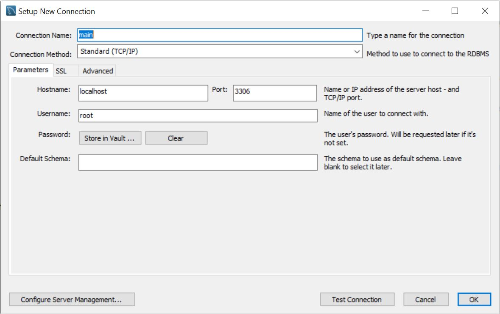
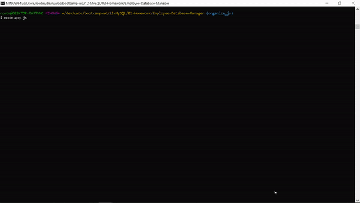

# Employee Management System
     
 


## Getting Started

This is a command-line content management system for Employee Data.

## Installation

1) Install node.js if you don't have it already.  Use the [package manager][] of your choice.
2) Install MySQL Workbench if you don't have it already. Use [this][] page
3) Set up a MySQL Connection with hostname `localhost` on port 3306.

4) On line 14 of [connection.js](./config/connection.js) enter your MySQL Connection password.
5) Use schema from [schema.sql](./schema.sql) to set up your database tables
6) Use [seeds.sql](/seeds.sql) to seed your database (or use your own data)
7) On command line run these commands
```
git clone https://github.com/JMantis0/Employee-Management-System ems
cd ems
npm install
node app.js
```
[package manager]: https://nodejs.org/en/download/package-manager/
[this]: https://dev.mysql.com/downloads/workbench/

## Usage

Select options from the menu using your keyboard.  You can view, add, update, and delete employee data.


## Credits

Trilogy 
Node.js
MySQL
npm inquirer
npm chalk
figlet

## License


Copyright (c) 2020 Jesse Mazur

Permission is hereby granted, free of charge, to any person obtaining a copy
of this software and associated documentation files (the "Software"), to deal
in the Software without restriction, including without limitation the rights
to use, copy, modify, merge, publish, distribute, sublicense, and/or sell
copies of the Software, and to permit persons to whom the Software is
furnished to do so, subject to the following conditions:

The above copyright notice and this permission notice shall be included in all
copies or substantial portions of the Software.

THE SOFTWARE IS PROVIDED "AS IS", WITHOUT WARRANTY OF ANY KIND, EXPRESS OR
IMPLIED, INCLUDING BUT NOT LIMITED TO THE WARRANTIES OF MERCHANTABILITY,
FITNESS FOR A PARTICULAR PURPOSE AND NONINFRINGEMENT. IN NO EVENT SHALL THE
AUTHORS OR COPYRIGHT HOLDERS BE LIABLE FOR ANY CLAIM, DAMAGES OR OTHER
LIABILITY, WHETHER IN AN ACTION OF CONTRACT, TORT OR OTHERWISE, ARISING FROM,
OUT OF OR IN CONNECTION WITH THE SOFTWARE OR THE USE OR OTHER DEALINGS IN THE
SOFTWARE.